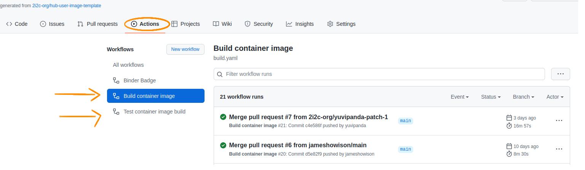
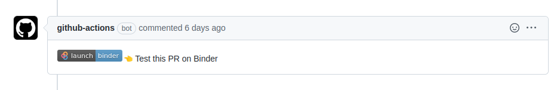

# hub-user-image-template :paperclip:

This is a template repository for creating dedicated user images for 2i2c hubs.

## Overall workflow :gear:

The overall workflow is to:

1. Fork this repository to create your image repository

2. Hook your image repository to quay.io

3. Customize the image by editing repo2docker files in your image repository.

   Changes can either be done by direct commits to main on your image repository, or through a pull request from a fork of your image repository. Direct commits will build the image and push it to Quay.io. PRs will build the image and offer a link to test it using Binder. Merging the PR will cause a commit on main and therefore trigger a build and push to Quay.io.

4. Configure your Hub to use this new image

### In-depth guide

Checkout the 2i2c docs for an in-depth guide on how to use this template repository to create a custom user image and use it for your hub :arrow_right: https://docs.2i2c.org/en/latest/admin/howto/environment/hub-user-image-template-guide.html.

## About this template repository :information_source:

This template repository enables [jupyterhub/repo2docker-action](https://github.com/jupyterhub/repo2docker-action).
This GitHub action builds a Docker image using the contents of this repo and pushes it to the [Quay.io](https://quay.io/) registry.

### The environment

It provides an example of a `environment.yml` conda configuration file for repo2docker to use.
This file can be used to list all the conda packages that need to be installed by `repo2docker` in your environment.
The `repo2docker-action` will update the [base repo2docker](https://github.com/jupyterhub/repo2docker/blob/HEAD/repo2docker/buildpacks/conda/environment.yml) conda environment with the packages listed in this `environment.yml` file.

**Note:**
A complete list of possible configuration files that can be added to the repository and be used by repo2docker to build the Docker image, can be found in the [repo2docker docs](https://repo2docker.readthedocs.io/en/latest/config_files.html#configuration-files).

### The GitHub workflows

This template repository provides two GitHub workflows that can build and push the image to quay.io when configured.

#### 1. Build and push container image :arrow_right: [build.yaml](https://github.com/2i2c-org/hub-user-image-template/blob/main/.github/workflows/build.yaml)

This workflow is triggered by every pushed commit on the main branch of the repo (including when a PR is merged).
It **builds** the image and **pushes** it to the registry.

#### 2. Test container image build :arrow_right: [test.yaml](https://github.com/2i2c-org/hub-user-image-template/blob/MAIN/.github/workflows/test.yaml)

This workflow is triggerd by every Pull Request commit and it **builds** the image, but it **doesn't** push it to the registry, unless explicitly configured to do so. Checkout [this section](https://docs.2i2c.org/en/latest/admin/howto/environment/hub-user-image-template-guide.html#enable-quay-io-image-push-for-test-yaml) on how to enable image pushes on Pull Requests.

#### 3. Test this PR on Binder Badge :arrow_right: [binder.yaml](https://github.com/2i2c-org/hub-user-image-template/blob/MAIN/.github/workflows/binder.yaml)

This workflow posts a comment inside a pull request, every time a pull request gets opened. The comment contains a "Test this PR on Binder" badge, which can be used to access the image defined by the PR in [mybinder.org](https://mybinder.org/).

